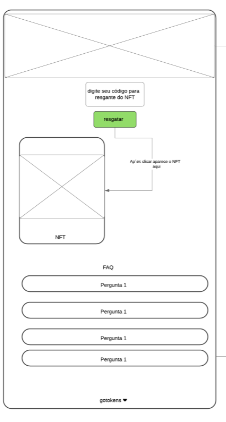
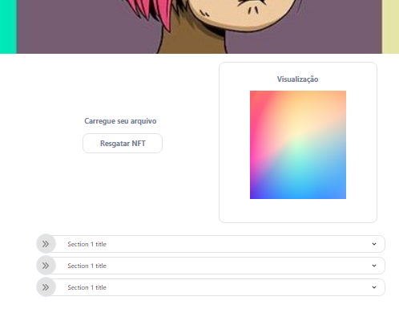

<h1 align="center">
 # Renderizando-img+FAQ
</h1>

  <a href="#-tecnologias">Tecnologias</a>&nbsp;&nbsp;&nbsp;|&nbsp;&nbsp;&nbsp;
  <a href="#-projeto">Projeto</a>&nbsp;&nbsp;&nbsp;|&nbsp;&nbsp;&nbsp;
  <a href="#-layout">Layout</a>&nbsp;&nbsp;&nbsp;|&nbsp;&nbsp;&nbsp;
  <a href="#-como-executar">Como executar</a>&nbsp;&nbsp;&nbsp;|&nbsp;&nbsp;&nbsp;
  <a href="#-licença">Licença</a>

  

 

## ✨ Tecnologias

Este é um projeto [Next.js](https://nextjs.org/) inicializado com [`create-next-app`] e desenvolvido com as seguintes tecnologias.

- [React](https://reactjs.org)
- [React DropZone](https://react-dropzone.js.org/)

## 💻 Projeto

Como implementar um sistema de upload de imagens no Front End com React , NextJs  e React DropZone, e de bônus como fazer uma FAQ perguntas frequentes.

Link do vídeo no youtube

- [Vídeo 1](https://www.youtube.com/watch?v=j2wXX92klDU)

## 💻 Layout

Esboço do projeto que vamos seguir:

  

## 🚀 Como executar

- Clone o repositório
- Instale as dependências com `Yarn install` ou `npm install`
- Abra o terminal e inicie o servidor do seu editor [`VScode`](https://code.visualstudio.com/) com `yarn dev` ou `npm run dev`

Abra [http://localhost:3000](http://localhost:3000) com seu navegador para ver o resultado.

O home deve ficar assim

  

A página é atualizada automaticamente conforme você edita o arquivo.

## 📄 Licença

Esse projeto está sob a licença MIT. Veja o arquivo [LICENSE](LICENSE.md) para mais detalhes.

---
# Lembrando que o conteúdo desse repositorio e apenas para apredizagem 

